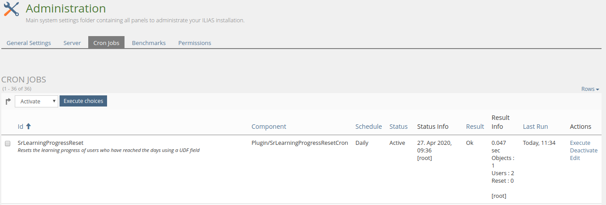

<!-- Autogenerated from composer.json - All changes will be overridden if generated again! -->

# SrLearningProgressResetCron ILIAS Plugin

Auto reset learning process

This project is licensed under the GPL-3.0-only license

## Requirements

* ILIAS 6.0 - 7.999
* PHP >=7.2

## Installation

Start at your ILIAS root directory

```bash
mkdir -p Customizing/global/plugins/Services/Cron/CronHook
cd Customizing/global/plugins/Services/Cron/CronHook
git clone https://github.com/fluxapps/SrLearningProgressResetCron.git SrLearningProgressResetCron
```

Update, activate and config the plugin in the ILIAS Plugin Administration

## Description

### Base plugin

First you need to install the [SrLearningProgressReset](https://github.com/fluxapps/SrLearningProgressReset) plugin

### Cron jobs

Cron job:


